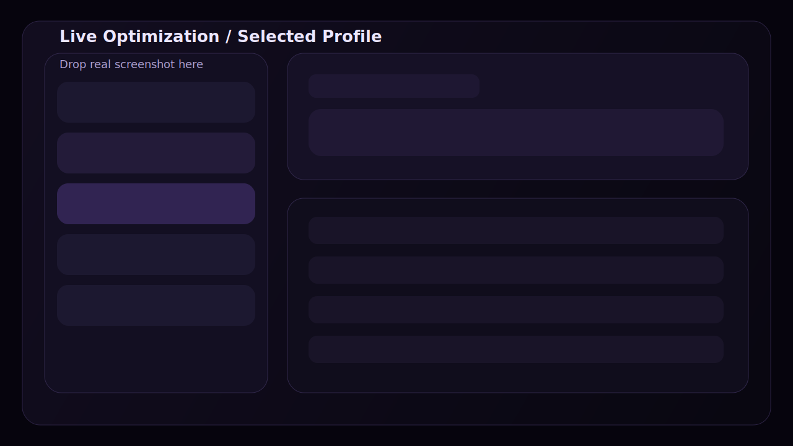
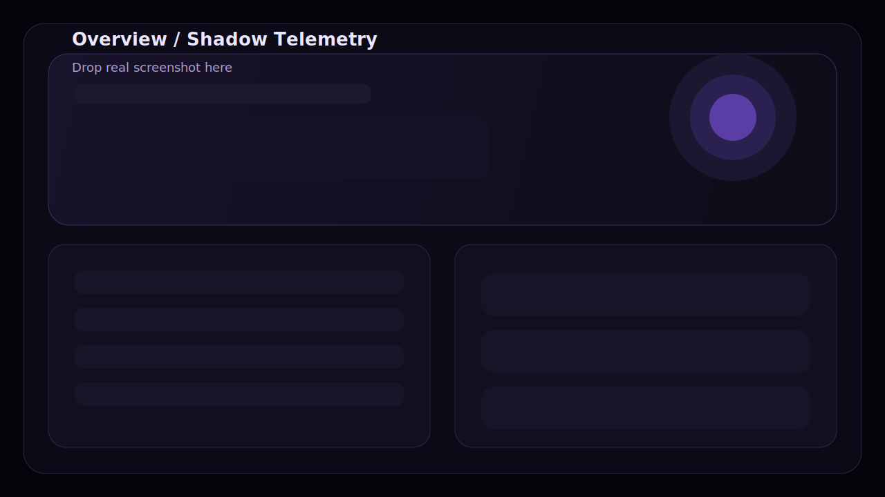
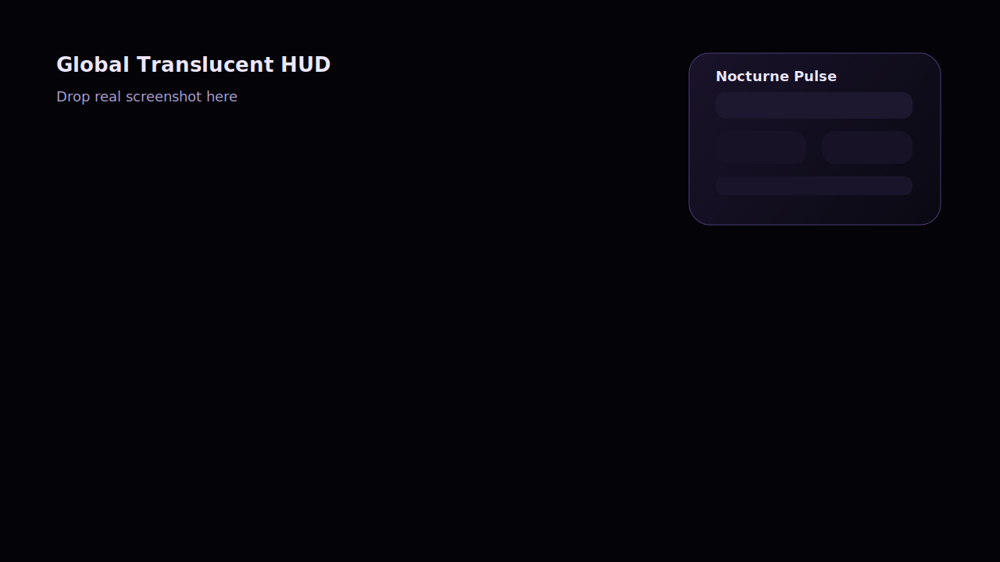

# Nocturne Optimizer

Windows-first optimizer built with Tauri 2, Rust, React and TypeScript.

## 01. Live Optimization / Selected Profile

This is the main workflow.

- `Selected Profile` is now the primary control surface.
- Processes are grouped into real app families instead of raw flat process spam.
- One rule can cover the full family:
  - Discord + updater + helper chain
  - Chrome + Google Update + renderer helpers
  - Edge + WebView / updater helpers
- HUD toggle is handled by Rust, so it still reacts when the frontend is under load.

## Preview Slots

| Live Optimization | Overview | HUD |
| --- | --- | --- |
|  |  |  |


## Core Modules

### 01. Overview


- rebuilt telemetry hero
- grouped heavy app families
- lower refresh pressure on the UI
- selected profile summary surfaced in the first screen

### 02. Live Optimization


- dark family picker instead of unreadable white selects
- grouped app family table with helper breakdown
- sticky selected profile panel
- per-family CPU / RAM / Disk / GPU sliders

### 03. Autostart


- scans:
  - `HKCU/HKLM Run`
  - `RunOnce`
  - `Policies\\Explorer\\Run`
  - `RunServices`
  - `WOW6432Node` startup keys
  - Startup folders
  - Scheduled Tasks
  - Services
- loading state while startup sources are being collected

### 04. Offline Optimization


- temp cleaner
- background quiet preset
- debloat-lite preset
- loading state for Windows apps and installed program inventory

### 05. Registry Health


- critical security and platform checks
- scan console
- repair console

### 06. Security


- app protection password
- relock on restore / activate
- startup password for Nocturne

### 07. Network


- adapter overview
- stored per-process network rule plans
- loading state while adapters and rules are fetched

### 08. Settings / HUD


- global translucent HUD
- Rust-driven show / hide hotkey
- manual HUD toggle button
- HUD placement designer

## Stack

- Backend: Rust
- Shell: Tauri 2
- Frontend: React + TypeScript + Vite
- UI: custom CSS + Lucide icons

## Development

```bash
npm install
npm run tauri dev
```

## Production Build

```bash
npm install
npm run build
npm run tauri build
```

Installer output:

```text
src-tauri\target\release\bundle\nsis\
```

## Notes

- Project is Windows-first.
- Some actions require Administrator privileges.
- Guard overlay does not replace Windows logon or Secure Desktop.
- Network rules are stored as process-oriented profiles. Full driver-level bandwidth enforcement would require deeper WFP integration.

## Reset Local State

Delete stale config files between experimental builds:

```text
%LOCALAPPDATA%\NocturneOptimizer\security.json
%LOCALAPPDATA%\NocturneOptimizer\settings.json
%LOCALAPPDATA%\NocturneOptimizer\rules.json
%LOCALAPPDATA%\NocturneOptimizer\network-rules.json
```
